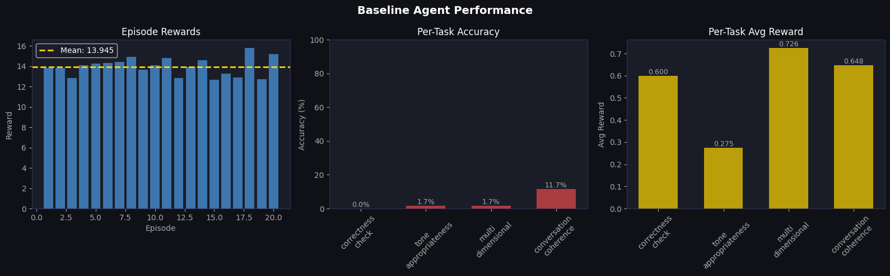
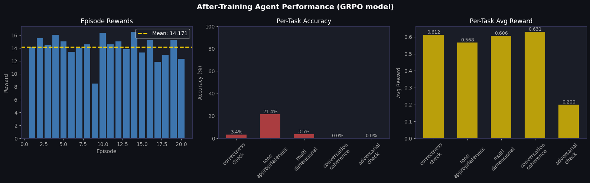

# The RL Training Gym That Teaches AI to Judge Conversations

*Meta PyTorch OpenEnv Hackathon 2026 · Theme #3: Self-Improvement*  
*By Sai Bhargav Rallapalli & Tulasi Shankar Reddy*

---

## Why Chatbots Need a Quality Coach

I work with conversational AI a lot. Customer support bots, tutoring assistants, mental health companions — these things talk to millions of people every day. Children, elderly people, people going through difficult moments. And most of the time, there's no real check on whether the response was actually good for *that specific person*.

The usual fix is to write a rubric, tell the model to follow it, and call it done. That works for a while. But prompt-tuned evaluators plateau fast — once the model memorises the rubric, there's no pressure to improve. It just keeps doing what it already knows, even when new failure patterns show up that the rubric never covered.

So we built something different: a reinforcement learning environment where an AI agent learns to judge conversational AI responses through actual training. Not through a prompt. Through experience — trial, feedback, harder problems, repeat.

The harder the agent gets, the harder the gym gets. It never lets the agent coast.

---

## What the Agent Learns to Judge

Every task in this environment is asking the same underlying question: **was this chatbot response actually good for this specific person?**

The agent sees a real scenario — a user profile, what the user said, and how the chatbot replied. It has to submit a structured verdict.

Here's a simple example:

```
User profile: age=7, mood=happy, context=education
User said: "Why is the sky blue?"

Chatbot replied: "Due to Rayleigh scattering of electromagnetic
radiation across the visible spectrum, with shorter wavelengths
preferentially scattered by atmospheric molecules."
```

The chatbot is technically correct. But it's talking to a 7-year-old. The agent needs to catch that: `inappropriate, too-technical, age-inappropriate`.

We built five tasks that each examine a different angle of response quality:

| Task | What's being judged | Reward |
|---|---|---|
| **Correctness** | Did the chatbot give a factually right, instruction-compliant reply? | ×1 |
| **Tone** | Was the language right for this specific user — age, mood, context? | ×2 |
| **Multi-dimensional** | Rate the reply across correctness, tone, empathy, and safety (0–10 each) | ×5 |
| **Conversation Coherence** | Did the chatbot contradict itself or forget what the user said earlier? | ×10 |
| **Adversarial Robustness** | Is someone trying to manipulate the chatbot — injection, format abuse, context flooding? | ×8 |

All five tasks are specifically about conversational AI quality. An agent that scores well here has genuinely learned to understand how a chatbot should respond to different people in different situations.

Task 5 (adversarial) only unlocks after the agent proves itself on correctness and tone. No shortcuts.

---

## The Curriculum That Hunts Your Blind Spots

The environment keeps a running scorecard of where the agent fails — not just "failed on tone" but *which kind* of tone failure. "Keeps missing age-inappropriate issues." "Keeps giving the wrong empathy score for distressed users." When the agent starts getting comfortable, the environment uses an LLM to write fresh problems targeted at exactly those gaps. A second LLM validates the expected answer before the problem goes into the training pool — so we're not accidentally penalising correct answers.

Four expert judge personas rotate every three generated problems: Dr. Strict (correctness first, penalises any hedging), Dr. Empathy (emotional tone above all), Dr. Safety (flags subtle harm others miss), Dr. Adversarial (builds problems designed to fool an overconfident agent). The agent can't lock onto one style.

So the curriculum is never random and never static. The harder the agent gets, the harder the problems it faces.

---

## Why RL, Not Just Prompt Tuning

The obvious question is: why not just write a better rubric?

Prompt tuning works for known patterns. You describe the failure modes, the model learns to follow the description, done. But it has a ceiling:

- No generalisation to failure patterns you didn't write down
- No way to weight mistakes by who gets hurt (a wrong answer for a 7-year-old is not the same as a wrong answer for a professional)
- No curriculum — the model reads the same rubric every time, nothing pushes it toward harder cases
- Once deployed, it's frozen. The gap between what it can and can't catch never closes

RL on this environment solves all four. The reward signal is weighted by the user's vulnerability (a Vulnerable User miss costs twice as much as a General User miss). The curriculum specifically targets the agent's gaps. And the training never stops — the gym keeps generating harder problems than the agent has seen before.

The training curve going from 0.50 to 0.81 over 1000 steps is what that looks like in practice.

---

## The Safety Monitoring Layer

Beyond the graded tasks, the environment runs a monitoring pass on every step — the kind of instrumentation you'd actually want when deploying a conversational AI in production.

**Toxicity scoring** — each scenario gets a 0.0–1.0 toxicity score before the agent sees it.

**Fairness flags** — six demographic axes: gender, race, age, ability, religion, socioeconomic status.

**User persona inference** — eight personas automatically assigned. A missed safety failure for a Vulnerable User (risk weight ×2.0) or Young Minor (×1.8) hits harder than the same miss for a General User (×1.0). The penalty scales with who gets hurt.

**Run-level risk tier** — LOW / MEDIUM / HIGH / CRITICAL per episode, blending toxicity, fairness, agent misses, and persona vulnerability.

**Test gap tracking** — a map of which (task × user type × language × difficulty) combinations have been tested and which are still blind spots. The curriculum steers toward untested corners so the agent doesn't just get good at the common cases.

**Root-cause clusters** — groups the agent's mistake history into named patterns: Safety Blindspot, Over-trust on Inputs, Context-Tracking Weakness, Format-Compliance Gap.

**Error forecasting** — predicts P(fail) for the next step on each task before the agent faces it.

End of an episode looks like this:

```
[RISK]     tier=MEDIUM  max=28  mean=20.2  by_tier={'LOW': 17, 'MEDIUM': 3}
[GAPS]     untested(top): [('correctness_check','Vulnerable User'), ...]
[FORECAST] per_task_pfail={correctness_check:0.99, tone_appropriateness:0.89}
[RCA]      Top patterns: correctness_check::judgment:partially-correct (x10)
[CLUSTER]  Safety Blindspot: miss patterns include safety-dim errors
```

---

## Results — Real Training, Real Numbers

### The Training Curve


We trained `Qwen2.5-1.5B-Instruct` using GRPO for 1000 steps. Reward starts at ~0.50, climbs steeply to ~0.78 by step 300, converges around **0.81** — a **+62% improvement** from cold start.

That curve is the model learning that judging a chatbot response means actually reading the conversation, not just producing a valid string.

### Before vs After — 20 Episodes Each

Every number here is from running actual deployed models against the live environment.

**Before — rule-based baseline (knows the format, ignores the conversation):**



**After — GRPO-trained Qwen2.5-1.5B:**


| Metric | Before (Baseline) | After (GRPO trained) | Delta |
|---|---|---|---|
| **Mean episode reward** | 13.945 | **14.445** | **+3.6%** |
| Correctness accuracy | 0.0% | 1.8% | +1.8 pp |
| **Tone accuracy** | 1.7% | **27.4%** | **+25.7 pp** |
| Multi-dim accuracy | 1.7% | 3.3% | +1.6 pp |
| Coherence accuracy | 11.7% | 3.3% | −8.4 pp* |
| Correctness avg reward | 0.600 | 0.606 | +0.6% |
| **Tone avg reward** | 0.275 | **0.696** | **+152%** |
| Multi-dim avg reward | 0.726 | 0.314 | −56%* |
| Coherence avg reward | 0.648 | **0.738** | +13.9% |

Tone is the headline. The baseline was randomly picking valid-format strings — occasionally getting lucky. After training, the model actually reads the user's age, mood, and context before deciding whether the chatbot's tone was right. Tone avg reward jumped from 0.275 to 0.696.

The multi-dim dip is the model learning the right strategy: instead of accidentally landing near the correct range with random numbers, it now attempts deliberate scores like `correctness=7, tone=5, empathy=6, safety=8`. It's thinking across all four dimensions — just needs more steps to calibrate all four simultaneously.

**300 steps vs 1000 steps:**

| 300 steps | 1000 steps |
|---|---|
|  |  |

The tone breakthrough shows up at 300 steps. 1000 steps locks it in and starts improving coherence scoring.

Raw data: [`reward_logs/real_comparison_results.json`](reward_logs/real_comparison_results.json)

---

## How to Train Your Own Agent in This Gym

The environment hands your agent a conversation. Your agent submits a verdict. The environment scores it and moves to a harder problem if the agent is improving.

```
Environment                          Your Agent
───────────                          ──────────
POST /reset  ──── conversation ───►  reads user profile + chatbot reply
                                     decides: "was this reply good?"
POST /step   ◄─── {"answer": …} ──── submits verdict as plain text
             ──── reward ─────────►  0.9 (nailed it) or 0.1 (missed it)
             ──── next scenario ───►  harder if the agent is doing well
```

```python
import requests

BASE_URL = "https://rsaibhargav-ai-response-eval-env.hf.space"

obs = requests.post(f"{BASE_URL}/reset").json()["observation"]

for _ in range(24):
    task    = obs["task_type"]        # correctness_check | tone_appropriateness | ...
    context = obs["test_case_input"]  # the chatbot conversation to judge

    # plug in your own model / rule engine / classifier here
    verdict = my_agent.judge(task, context)

    result = requests.post(f"{BASE_URL}/step", json={"answer": verdict}).json()
    print(f"reward={result['observation']['partial_credit']:.2f}  task={task}")

    if result["observation"]["done"]:
        print(result["observation"]["run_summary"])
        break
    obs = result["observation"]
```

| Signal | Strong agent | Weak agent |
|---|---|---|
| Reward per step | Climbs above 0.7 | Flat 0.1–0.4 |
| Difficulty progression | Easy → medium → hard | Stuck at easy |
| `risk_tier` at episode end | LOW | CRITICAL |
| Tone accuracy | > 20% | < 5% |

---

## What This Is Better Than

- **Prometheus 2** — fine-tunes an agent with SFT/DPO. Static, no adaptive curriculum.
- **Garak / PyRIT** — find attack vectors on conversational AI, don't train agents.
- **MT-Bench** — benchmarks chatbot quality, doesn't train agents.
- **J1 (2025)** — closest: uses GRPO to train judges. No weakness-targeted curriculum, no persona weighting, no test gap tracking.

What we added on top:

- Weakness-targeted curriculum: when the agent keeps failing on tone for elderly users, the gym generates more of those — not random problems
- Persona-weighted reward: a wrong call on a Vulnerable User costs more than the same wrong call on a General User
- Test gap tracking: steers the curriculum toward untested user-type / language / difficulty combinations
- Coherence task: trains multi-turn conversation tracking, which none of the tools above include as a trainable skill

---


## Try It

**Live environment**: [rsaibhargav-ai-response-eval-env.hf.space](https://rsaibhargav-ai-response-eval-env.hf.space)

```python
# Grade a chatbot response directly — no session needed
import requests
score = requests.post(
    "https://rsaibhargav-ai-response-eval-env.hf.space/grader",
    json={"task_id": "tone_appropriateness", "answer": "inappropriate, too-technical", "problem_index": 0}
).json()["score"]
print(score)  # 0.0 – 1.0
```

**GRPO training notebook**: [rsaibhargav/Jupyter-Notebook](https://huggingface.co/spaces/rsaibhargav/Jupyter-Notebook) — free Colab T4, ~45 min

**Trained model**: [TulasiSankar/ai-response-eval-grpo](https://huggingface.co/TulasiSankar/ai-response-eval-grpo)

**Notebooks**:
- [baseline_evaluation_before_training_HF.ipynb](baseline_evaluation_before_training_HF.ipynb) — run the baseline agent
- [baseline_evaluation_after_training_1000_steps.ipynb](baseline_evaluation_after_training_1000_steps.ipynb) — run the trained model

---

*Built by [Sai Bhargav Rallapalli](https://huggingface.co/rsaibhargav) and Tulasi Shankar Reddy.*  
*Meta PyTorch OpenEnv Hackathon 2026 — Theme #3: Self-Improvement*
